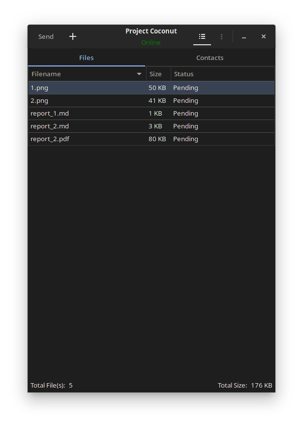

# Desktop Client for Project Coconut

#### An open-source, cross-platform program for file sharing.

### Features

- End-to-end encryption
- Optional port forwarding (UDP hole punching)
- Peer-to-peer connection
- Supported operating systems: Windows, macOS, Linux, Android, iOS

### Installation

TODO: Add installation instructions
